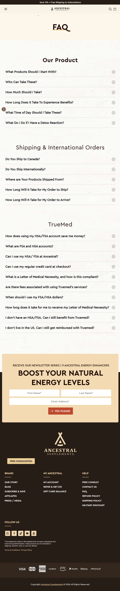

Ancestral Supplements
Website: https://ancestralsupplements.com
Tracking URL: Không có public tracking page (chỉ có FAQ shipping)
Category: Ancestral / Nose-to-Tail Organ Supplements
Nhóm phân loại: 3 (Không có tracking page public)

Giới thiệu brand
Ancestral Supplements là brand pioneer trong trào lưu "nose-to-tail" organ supplements - sử dụng nội tạng bò/bison grass-fed freeze-dried dưới dạng viên capsule. Sáng lập bởi Brian Johnson (Liver King), định vị là "restore vitality" với narrative ancestral/paleo. Brand có vị thế cult trong cộng đồng paleo/carnivore và xuất khẩu quốc tế.

Sản phẩm chủ lực
- Grass Fed Beef Liver (flagship)
- Grass Fed Beef Organs (multi-organ blend)
- Beef Bone Marrow
- Beef Thyroid / Brain / Kidney
- Colostrum
- Living Collagen
- Whole Bone Calcium

Tracking page - Mô tả UI
Brand không có dedicated tracking page. Thay vào đó có /pages/faq với section "Shipping & International Orders" chứa FAQ về thời gian ship, đối tác carrier, quốc gia ship tới. Không có form order lookup. Khách phải dựa vào email giao dịch Shopify hoặc login account để xem trạng thái đơn. Footer có Shipping Policy, Contact Us, FAQ.

Có upsell không? Nếu có, hình thức gì?
Không áp dụng trên tracking flow. Trang FAQ có newsletter capture "Boost Your Natural Energy Levels" với email form - dạng lead gen nhưng không phải upsell contextual post-purchase.

Vì sao họ chèn widget đó? (phân tích)
Ancestral Supplements là brand cult-driven với community mạnh:
1. Khách đã highly engaged qua content (Liver King, Brian Johnson ecosystem)
2. Retention dựa vào education/content thay vì commercial widget
3. Subscription auto-ship là mô hình chính - khách lock-in, ít cần tracking widget
Nhưng họ vẫn bỏ lỡ cơ hội cross-sell giữa các loại organ (khách mua liver → có thể mua bone marrow, thyroid, etc).

Điểm mạnh của tracking page
- FAQ shipping chi tiết
- Newsletter capture tốt
- Brand storytelling mạnh

Điểm yếu / hạn chế
- Không self-service order lookup
- Bỏ lỡ cross-sell đa SKU (category fragment cao)
- Tăng support ticket cho shipping question

Screenshot

