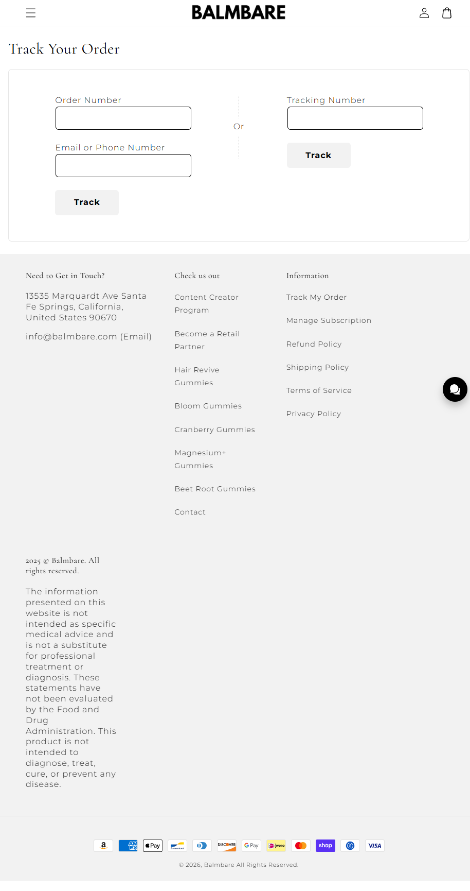

Balmbare
Website: https://balmbare.com
Tracking URL: https://balmbare.com/apps/parcelpanel
Category: Gummy Supplements / Wellness (Hair, Beauty, Beet Root, Magnesium)
Nhóm phân loại: 2 (Có tracking page nhưng không có upsell widget contextual)

Giới thiệu brand
Balmbare là thương hiệu gummy supplement DTC gốc California (Santa Fe Springs), vận hành Shopify, tập trung vào các dòng gummy wellness dạng ăn liền thay cho viên nén. SKU line rộng bao phủ nhiều ngách: hair/beauty, gut (cranberry, beet root), sleep/recovery (magnesium). Chạy Content Creator Program và Retail Partner, cho thấy chiến lược growth influencer/affiliate.

Sản phẩm chủ lực
- Hair Revive Gummies
- Bloom Gummies
- Cranberry Gummies
- Magnesium+ Gummies
- Beet Root Gummies

Tracking page - Mô tả UI
Trang /apps/parcelpanel có layout chuẩn của app ParcelPanel: heading "Track Your Order", 2 option form song song (Order Number + Email/Phone | Tracking Number), 2 button "Track" riêng biệt. Phía dưới là footer 3 cột: Contact (California address + email), Check us out (Content Creator Program, Retail Partner, list sản phẩm), Information (Track My Order, Manage Subscription, Refund, Shipping, Terms, Privacy). Không có hero marketing, không có product recommendation grid.

Có upsell không? Nếu có, hình thức gì?
Không có upsell contextual. Footer có:
- List sản phẩm dưới dạng navigation link (5 SKU)
- Manage Subscription link
- Content Creator/Retail Partner recruit
Chỉ là navigation/link, không phải widget chủ động hiển thị sản phẩm.

Vì sao họ chèn widget đó? (phân tích)
Balmbare setup tracking minimal:
1. Dùng ParcelPanel free tier - không có slot customization
2. Budget marketing focus vào influencer/affiliate recruitment hơn post-purchase
3. Brand relatively mới, chưa đủ data để design tracking UX
4. Gummy là category cross-sell cực tốt nhưng chưa khai thác (mua hair → bán beet root → bán magnesium)

Điểm mạnh của tracking page
- Dual input option (Order hoặc Tracking number)
- Footer navigation đầy đủ
- Load nhanh
- Brand voice clean

Điểm yếu / hạn chế
- Không có hero/banner marketing
- Không có product recommendation
- Không có social proof
- Bỏ lỡ cross-sell SKU-to-SKU (cực quan trọng cho category gummy multi-line)
- Đây là pitch case lý tưởng: brand đã có nhiều SKU nhưng tracking page không cross-sell

Screenshot

