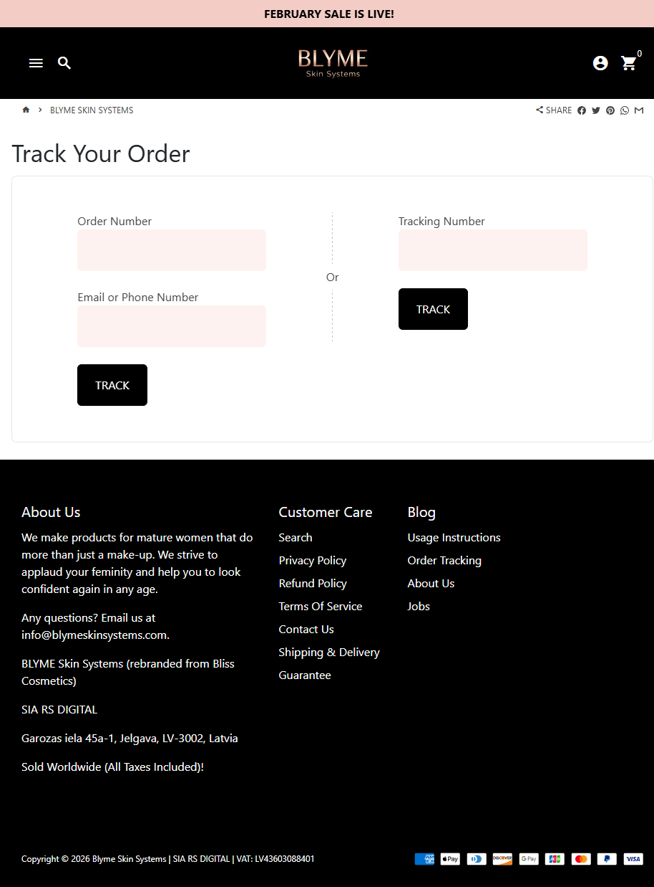

BLYME Skin Systems
Website: https://blymeskinsystems.com
Tracking URL: https://blymeskinsystems.com/apps/parcelpanel
Category: Mature Women Skincare / Silver Ladies (50+)
Nhóm phân loại: 2 (Có tracking page nhưng không có upsell widget contextual)

Giới thiệu brand
BLYME Skin Systems là thương hiệu skincare định vị "For Silver Ladies" - chuyên cho phụ nữ trưởng thành/lớn tuổi (50+), với mission "applaud your femininity and help you look confident again in any age". Rebrand từ "Bliss Cosmetics" trước đây. Operator là SIA RS DIGITAL tại Latvia (Jelgava LV-3002), bán worldwide (all taxes included). Shopify store với app ParcelPanel cho tracking.

Sản phẩm chủ lực
- Skincare cho mature skin (anti-aging focus)
- Facial cream / moisturizer
- Eye cream
- Serum
- Make-up for mature women ("do more than just a make-up")
(Không verify được chi tiết SKU từ tracking page)

Tracking page - Mô tả UI
Trang /apps/parcelpanel có layout clean:
1. Announcement bar pink pastel "February Sale is Live!"
2. Header đen với logo BLYME Skin Systems
3. Breadcrumb Home > BLYME Skin Systems
4. Share buttons (Facebook/Twitter/Pinterest/WhatsApp/Email)
5. Heading "Track Your Order"
6. Dual input form trong card với border: Order Number + Email/Phone OR Tracking Number
7. 2 button "TRACK" đen rectangular
8. Footer đen 3 cột: About Us (brand story), Customer Care (policies), Blog (usage, order tracking, about, jobs)
9. Business info: SIA RS DIGITAL Latvia + VAT number
10. Payment badges

Có upsell không? Nếu có, hình thức gì?
Không có upsell widget contextual. Chỉ có:
- Announcement bar sale banner
- Footer navigation về blog/usage instructions (có thể giáo dục)
Không có product grid, bundle, testimonial hay quiz.

Vì sao họ chèn widget đó? (phân tích)
BLYME có setup cơ bản với ParcelPanel:
1. Brand rebrand gần đây (từ Bliss → BLYME) → có thể đang trong giai đoạn chuyển đổi
2. Operator EU (Latvia) với compliance chặt → conservative về marketing on-page
3. Target demographic 50+ prefer clean UI, không overwhelm
4. Scale vừa phải → chưa đủ resource cho custom tracking widget
5. Focus vào usage instructions (blog) hơn commercial upsell

Điểm mạnh của tracking page
- Layout clean phù hợp demographic mature
- Business info minh bạch (VAT, Latvia registration)
- Share buttons cho viral potential
- Usage instructions link trong footer (giảm return rate)

Điểm yếu / hạn chế
- Không có product recommendation (mature skincare cross-sell rất tự nhiên: serum → cream → eye cream → toner)
- Không có social proof cho brand rebrand (cần build trust)
- Không có content block về anti-aging education
- Đây là brand medium-sized tiềm năng pitch upgrade

Screenshot

