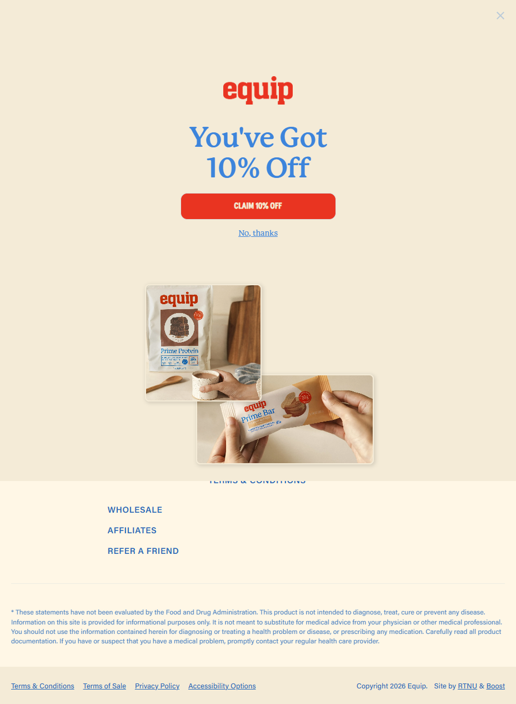

Equip Foods
Website: https://www.equipfoods.com
Tracking URL: https://www.equipfoods.com/pages/tracking
Category: Real Food Nutrition / Grass-Fed Protein / Paleo
Nhóm phân loại: 1 (Có tracking page + Có upsell)

Giới thiệu brand
Equip Foods là thương hiệu "real food to fuel your body" với định vị paleo/ancestral nutrition. Sản phẩm chủ đạo là beef protein (thay vì whey), beef organ supplements, và các real-food bar/powder không chứa phụ gia. Brand mạnh trong cộng đồng CrossFit, paleo, carnivore diet. Được sáng lập/associated với Dr. Anthony Gustin (chiropractor, nổi tiếng trong paleo community). Shopify-based.

Sản phẩm chủ lực
- Prime Protein (beef protein isolate flagship)
- Prime Bar (real food protein bar)
- Beef Organs & Liver capsules
- Colostrum
- Collagen Peptides
- Pique (collagen boost / greens)

Tracking page - Mô tả UI
Trang /pages/tracking mở ra với popup overlay full screen "You've Got 10% Off - CLAIM 10% OFF" ngay lập tức. Popup hiển thị hình sản phẩm Prime Protein và Prime Bar với style lifestyle photography. Dưới popup là footer với link Wholesale, Affiliates, Refer a Friend. Tracking form thực sự bị ẩn dưới popup - khách phải đóng popup hoặc "No, thanks" mới thấy được.

Có upsell không? Nếu có, hình thức gì?
Có:
- Popup 10% off email capture ngay khi load trang (hiển thị trước cả tracking form)
- Product hero hiển thị Prime Protein + Prime Bar
- Refer a Friend CTA (referral upsell)
- Wholesale/Affiliate links

Vì sao họ chèn widget đó? (phân tích)
Equip Foods tận dụng post-purchase traffic cực kỳ aggressive:
1. Khách đang quan tâm đơn hàng (trust cao) → dễ submit email cho discount
2. Email capture + 10% off là hook chuẩn để cross-sell sang SKU khách chưa mua
3. Referral loop: khách đang mong đơn → dễ share với bạn bè (gift discount)
4. Paleo/CrossFit community là highly word-of-mouth → referral program hiệu quả

Điểm mạnh của tracking page
- Email capture aggressive (tận dụng intent cao)
- Referral flywheel rõ ràng
- Brand photography đẹp, nhất quán

Điểm yếu / hạn chế
- Popup che hoàn toàn tracking form - có thể gây khó chịu
- Nếu khách chỉ muốn check đơn nhanh, UX bị cản trở
- Thiếu product grid rộng hơn ở dưới form
- Quá phụ thuộc vào discount (có thể erode margin)

Screenshot

