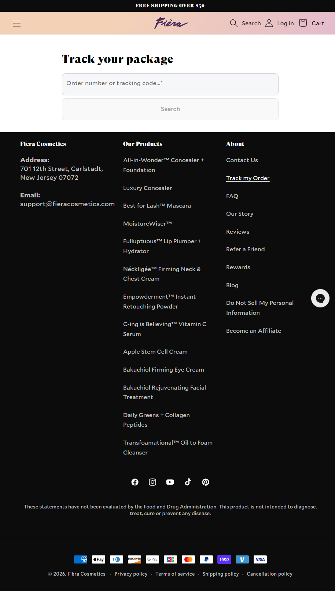

Fièra Cosmetics
Website: https://fieracosmetics.com
Tracking URL: https://fieracosmetics.com/pages/tracking-page
Category: Mature Skin Cosmetics / Anti-aging Beauty
Nhóm phân loại: 2 (Có tracking page nhưng không có upsell widget contextual)

Giới thiệu brand
Fièra Cosmetics là thương hiệu skincare & cosmetics chuyên cho da trưởng thành (mature skin), nhắm vào phụ nữ 45+. Brand gốc New Jersey (Carlstadt), vận hành trên Shopify, có dòng sản phẩm đa dạng từ makeup (concealer, mascara, lip plumper) đến skincare (vitamin C serum, firming cream, eye cream, cleanser). Brand tuyên bố có loyalty rewards program và referral program.

Sản phẩm chủ lực
- All-in-Wonder™ Concealer + Foundation (flagship)
- Best for Lash™ Mascara
- MoistureWiser™
- Fullluptuous™ Lip Plumper + Hydrator
- Nécklégée™ Firming Neck & Chest Cream
- C-ing is Believing™ Vitamin C Serum
- Apple Stem Cell Cream
- Bakuchiol Firming Eye Cream
- Daily Greens + Collagen Peptides

Tracking page - Mô tả UI
Trang /pages/tracking-page rất tối giản: heading "Track your package", single input field "Order number or tracking code", CTA "Search". Không có tab, không có hero image. Bên dưới là footer dark đầy đủ với 3 cột: Company address/email, Our Products (list toàn bộ SKU), About (Contact, Track, FAQ, Refer a Friend, Rewards, Blog). Social icons và payment badges ở cuối.

Có upsell không? Nếu có, hình thức gì?
Không có upsell contextual. Tuy nhiên footer có:
- Product list (navigation dẫn từng SKU)
- Refer a Friend (referral upsell)
- Rewards (loyalty program)
- Newsletter không hiện rõ

Những item này là navigation link, chưa phải widget recommendation chủ động.

Vì sao họ chèn widget đó? (phân tích)
Fièra có setup footer tốt nhưng tracking page body thì tối giản:
1. Team marketing focus vào email flow và referral thay vì on-page widget
2. Loyalty rewards chạy qua program riêng (không embed vào tracking)
3. Category mature skin cần trust - brand ngại aggressive popup
4. Có thể họ dựa vào footer navigation giả định khách sẽ tự browse

Điểm mạnh của tracking page
- Load nhanh, siêu sạch
- Footer product navigation đầy đủ
- Có refer a friend + rewards link rõ
- Brand voice sang trọng phù hợp demographic 45+

Điểm yếu / hạn chế
- Body trang quá trống, chỉ có form search
- Không có product recommendation contextual
- Bỏ lỡ cross-sell (khách mua serum có thể mua thêm cream, collagen)
- Không có testimonial/social proof

Screenshot

