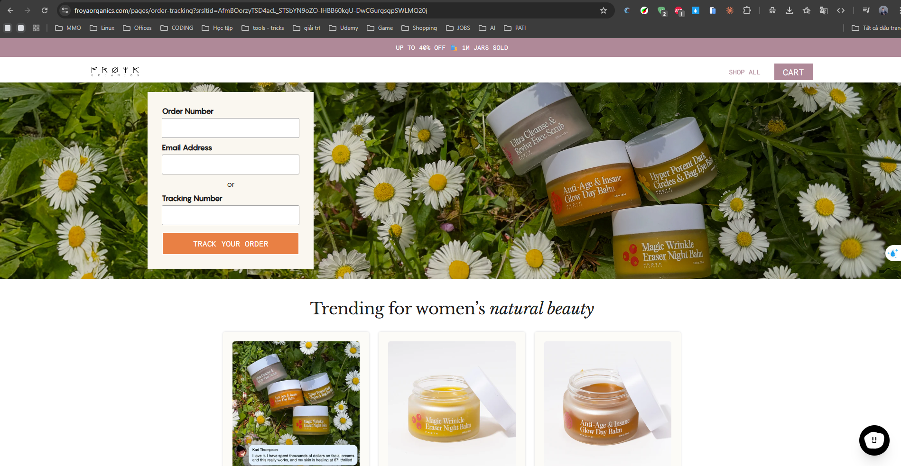
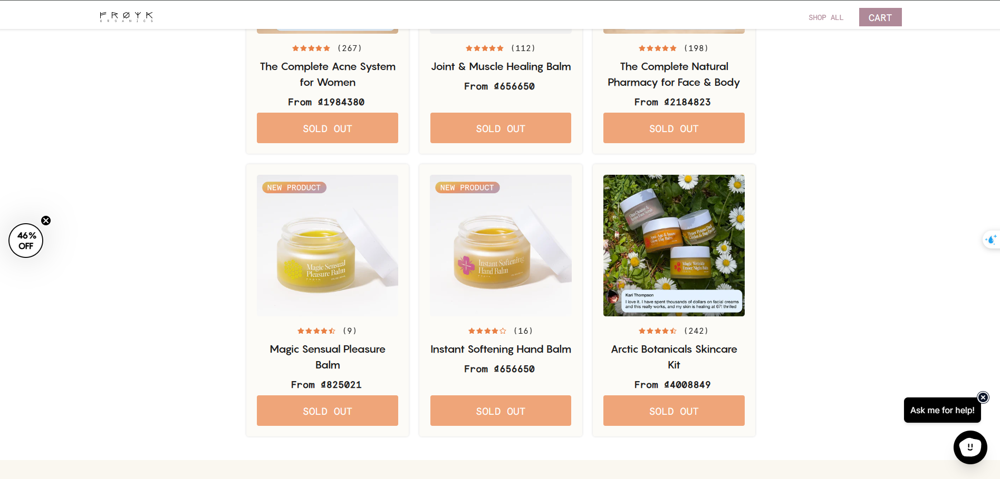
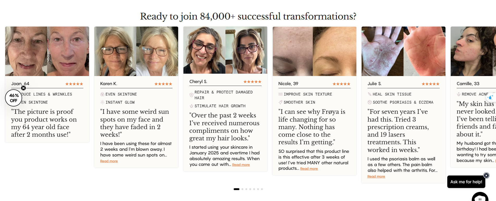

Frøya Organics
Website: https://froyaorganics.com
Tracking URL: https://froyaorganics.com/pages/order-tracking
Category: Clean Beauty / Skincare & Haircare (Arctic botanicals)
Nhóm phân loại: 1 (Có tracking page + Có upsell)

Giới thiệu brand
Frøya Organics là thương hiệu skincare & haircare "ultra potent" sử dụng nguyên liệu thực vật Bắc Cực (Arctic plants). Brand định vị clean beauty cao cấp với câu chuyện xuất xứ Scandinavia, thành phần sea buckthorn, cloudberry, birch sap. Chạy trên Shopify, tập trung US/EU market, sản phẩm mang tính premium và subscription-friendly.

Sản phẩm chủ lực
- Hair Growth Serum / Hair Density Booster
- Face Serum với Arctic botanicals
- Facial Cleanser / Toner
- Body Oil / Bath Ritual
- Beard & men's grooming line (nếu có)
- Subscription bundles

Tracking page - Mô tả UI
Trang /pages/order-tracking có widget tracking đầy đủ (form order + email → status timeline) kết hợp với nhiều block marketing phía dưới: hero banner brand story, product bestseller grid, testimonials có ảnh trước/sau, banner subscription save 15-20%, và content giáo dục về ingredient Arctic. Thiết kế sang trọng nhất quán với brand identity.

Có upsell không? Nếu có, hình thức gì?
Có, rất đa dạng:
- Product recommendation grid (bestseller skin/hair)
- Bundle cross-sell (mua thêm để save)
- Subscription banner với discount
- Testimonial + before/after social proof
- Content block về ingredient origin story
- Quiz "Tìm routine phù hợp"
- Capture email / SMS discount cho khách chưa subscribe

Vì sao họ chèn widget đó? (phân tích)
Frøya Organics nằm ở category beauty/skincare nơi:
1. Post-purchase anxiety cao (khách chờ sản phẩm premium, quay lại check 4-5 lần)
2. Cross-sell rất tự nhiên (skin routine cần nhiều step)
3. Margin cao → dễ chạy subscription discount
4. Content storytelling gia tăng perceived value → giữ khách không return

Điểm mạnh của tracking page
- Tận dụng tối đa post-purchase traffic
- Brand storytelling nhất quán
- Nhiều touchpoint upsell khác nhau, không nhàm chán
- Design thẩm mỹ cao, không rẻ tiền

Điểm yếu / hạn chế
- Nhiều content có thể làm trang nặng/load chậm
- Với khách chỉ muốn check đơn nhanh, trang có thể hơi "over-marketed"

Screenshot

