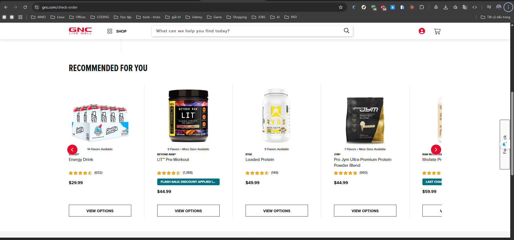
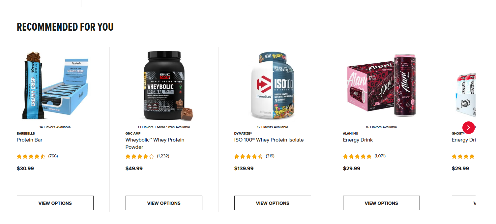

GNC
Website: https://www.gnc.com
Tracking URL: https://www.gnc.com/check-order
Category: General Wellness / Sports Nutrition / Vitamins & Supplements
Nhóm phân loại: 1 (Có tracking page + Có upsell)

Giới thiệu brand
GNC (General Nutrition Centers) là chuỗi bán lẻ dinh dưỡng và thực phẩm bổ sung lớn nhất Hoa Kỳ, thành lập năm 1935, với hơn 4.000 cửa hàng toàn cầu. Là thương hiệu "mass market" được tin dùng rộng rãi, cung cấp đa dạng sản phẩm từ vitamin hàng ngày đến sports nutrition chuyên sâu. Hiện thuộc sở hữu của Harbin Pharmaceutical (Trung Quốc) sau thương vụ 2020.

Sản phẩm chủ lực
- Mega Men / Women's Ultra Mega (multivitamin flagship)
- Pro Performance whey protein, creatine, pre-workout
- Total Lean (dòng weight management)
- Herbal Plus (thảo dược: turmeric, ashwagandha, ginseng)
- Triflex (joint support glucosamine-chondroitin)
- GNC Preventive Nutrition (omega-3, probiotic, collagen)

Tracking page - Mô tả UI
Trang /check-order là form nhập Order Number + email/ZIP, sau khi submit hiển thị status timeline (Placed → Processing → Shipped → Delivered), chi tiết order items kèm hình ảnh, số tracking carrier (UPS/FedEx), địa chỉ giao. Bên dưới có các khối marketing: banner khuyến mãi thành viên myGNC Rewards, gợi ý sản phẩm "You Might Also Like", link đăng ký subscription và cross-sell vào dòng sports nutrition.

Có upsell không? Nếu có, hình thức gì?
Có. Các widget upsell chính:
- Banner promo chương trình thành viên myGNC Rewards (tích điểm, miễn phí ship)
- Product recommendation grid dựa trên order history
- CTA mua lại (Reorder) và chuyển sang subscription để giảm giá
- Link cross-category (từ vitamin sang sports, hoặc weight management)

Vì sao họ chèn widget đó? (phân tích)
GNC tận dụng post-purchase traffic - thời điểm khách quay lại check đơn ≥3-4 lần/đơn - để:
1. Tăng AOV thông qua cross-sell/upsell (khách đã tin tưởng, dễ mua thêm)
2. Chuyển one-time buyer sang subscription (LTV cao hơn ~3-5x)
3. Đẩy chương trình loyalty để giảm chi phí acquisition lần sau
4. Giảm support ticket nhờ self-service tracking

Điểm mạnh của tracking page
- UX quen thuộc, không cần login
- Tích hợp tốt với loyalty & subscription
- Product recommendation contextual theo lịch sử mua

Điểm yếu / hạn chế
- Thiếu interactive element (không có quiz, không có live chat)
- Upsell còn generic, chưa cá nhân hoá sâu theo đơn hàng vừa mua
- Thiết kế cũ, chưa tối ưu mobile hiện đại

Screenshot

