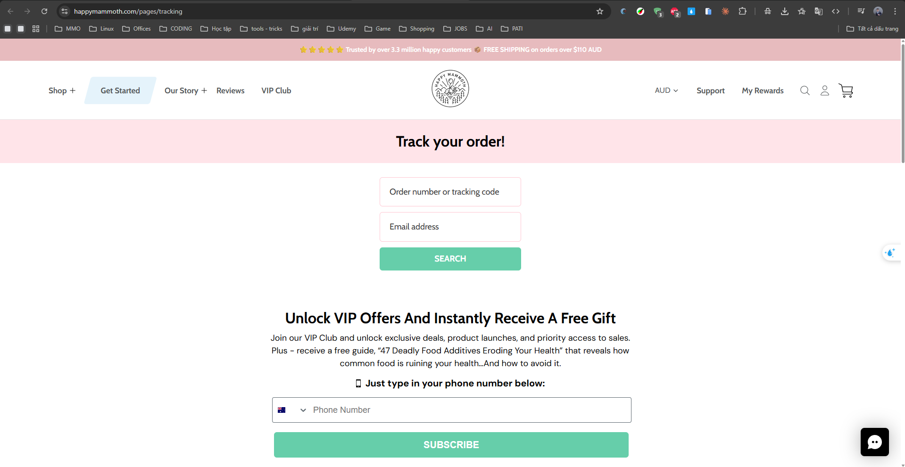
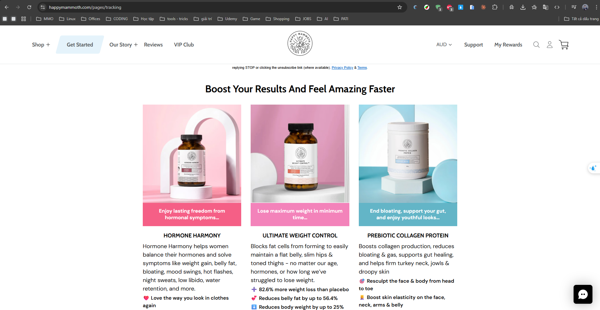

Happy Mammoth
Website: https://happymammoth.com
Tracking URL: https://happymammoth.com/pages/tracking
Category: Women's Wellness / Gut Health / Hormonal Balance
Nhóm phân loại: 1 (Có tracking page + Có upsell)

Giới thiệu brand
Happy Mammoth là thương hiệu wellness gốc Úc (sáng lập tại Sydney), chuyên về gut health và hormonal balance cho phụ nữ 35+. Brand nổi tiếng với flagship Hormone Harmony - one of the best-selling menopause supplements trên DTC space - và phát triển mạnh tại Úc, Mỹ, UK. Họ sử dụng thành phần thực vật được adaptogen/clinically-tested và vận hành trên Shopify Plus với paid media rất mạnh.

Sản phẩm chủ lực
- Hormone Harmony (flagship - hỗ trợ menopause, PMS, hot flashes)
- Deep Sleep Mode (magnesium + GABA sleep formula)
- Total Cleanse (gut cleanse)
- Body Reset (metabolism support)
- Estro-Adapt / Cortisol Manager
- Digestive enzyme blends

Tracking page - Mô tả UI
Trang /pages/tracking kết hợp widget tracking (form nhập order number + email, hiển thị status timeline) với các khối marketing bên dưới: giới thiệu bestseller, testimonial từ khách đã dùng, banner subscription discount, link điều hướng đến quiz "Find your supplement". Thiết kế theo style brand - pastel, friendly, female-focused.

Có upsell không? Nếu có, hình thức gì?
Có. Nhiều hình thức:
- Product recommendation grid (các bestseller)
- Testimonial/social proof để build trust cho cross-sell
- Banner subscription discount
- Quiz "Find your perfect formula" - vừa educate vừa capture lead
- Content block giáo dục về hormone/gut health (tăng engagement và authority)

Vì sao họ chèn widget đó? (phân tích)
Happy Mammoth có chiến lược post-purchase marketing cực kỳ tinh vi:
1. Khách đang chờ đơn = moment of anticipation cao, dễ tương tác với content
2. Category của họ (menopause/hormone) cần cross-sell vì khách thường mua 2-3 sản phẩm combo
3. Subscription là KPI chính - cần chuyển one-time buyer sang sub
4. Quiz vừa cá nhân hóa vừa giảm churn bằng cách dẫn khách đến đúng formula
5. Content giáo dục tăng LTV và giảm return rate

Điểm mạnh của tracking page
- Tận dụng tốt post-purchase traffic
- Cá nhân hóa qua quiz
- Tone brand nhất quán, không gây phản cảm
- Social proof mạnh

Điểm yếu / hạn chế
- Trang có thể load chậm do nhiều asset
- Content đôi lúc dài, làm loãng mục đích chính (check đơn)

Screenshot

