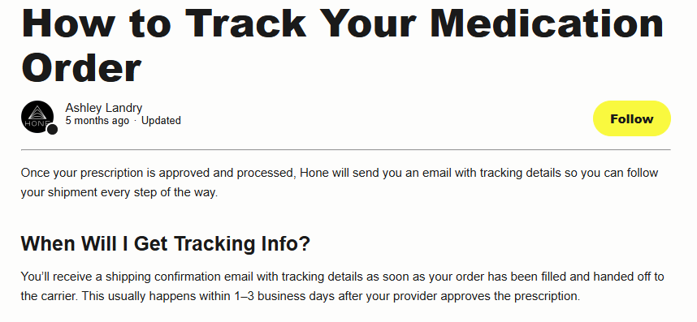

Hone Health
Website: https://honehealth.com
Tracking URL: https://help.honehealth.com/hc/en-us/articles/31264655436311-How-to-Track-Your-Medication-Order
Category: Men's Health / TRT Telemedicine / Hormone Optimization
Nhóm phân loại: 2 (Có trang tracking nhưng là help article, không có upsell)

Giới thiệu brand
Hone Health là công ty telemedicine Mỹ chuyên về testosterone replacement therapy (TRT) và hormone optimization cho nam giới. Họ không phải brand supplement thông thường - mà là healthcare platform với bác sĩ kê đơn, lab test tại nhà, và thuốc được ship từ compounding pharmacy. Khách hàng chủ yếu là nam 30-60 đối mặt với low T, fatigue, low libido. Funded bởi VC lớn, định vị premium.

Sản phẩm chủ lực
- At-home hormone lab test kit
- TRT prescription program (testosterone cypionate, enclomiphene, HCG)
- Weight loss (GLP-1 semaglutide)
- Peptide therapy
- Sleep / cognitive supplements
- Telehealth consultation package

Tracking page - Mô tả UI
Không có tracking page dạng ecommerce. Thay vào đó, brand dùng Zendesk help center với một article hướng dẫn khách tra cứu trạng thái đơn thuốc trong account dashboard hoặc qua SMS từ pharmacy. Layout là help article text-heavy, có screenshot minh họa, không có form lookup, không có upsell widget.

Có upsell không? Nếu có, hình thức gì?
Không. Vì đây là healthcare regulated (prescription drugs), brand không được phép chạy upsell commercial trên trang hướng dẫn tracking đơn thuốc. Chỉ có navigation về homepage và CTA liên hệ support.

Vì sao họ chèn widget đó? (phân tích)
Hone Health bị ràng buộc bởi:
1. Compliance healthcare - không thể upsell thuốc trên trang tracking
2. Mô hình subscription-based prescription - khách đã lock vào plan, không cần upsell thêm
3. Support-centric thay vì commercial-centric (ưu tiên giảm lo lắng khách hàng về thuốc)
Tuy nhiên họ VẪN có thể upsell các dòng non-prescription (supplement, peptide OTC) nhưng chưa làm.

Điểm mạnh của tracking page
- Compliance-friendly cho healthcare
- Rõ ràng, không gây nhiễu cho khách đang chờ thuốc
- Có hướng dẫn step-by-step

Điểm yếu / hạn chế
- Không phải tracking page theo nghĩa thực, chỉ là bài viết FAQ
- Không có self-service order lookup
- Bỏ lỡ cơ hội upsell các SKU non-prescription (supplement lines)
- UX kém hơn DTC brands cùng category

Screenshot

