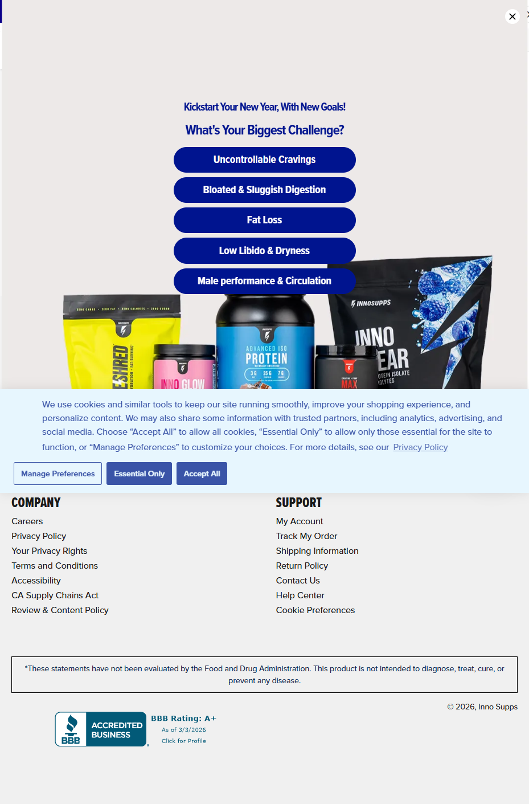

Inno Supps
Website: https://www.innosupps.com
Tracking URL: https://www.innosupps.com/pages/track-my-order
Category: Sports Nutrition / Men's & Women's Health / Weight Loss
Nhóm phân loại: 1 (Có tracking page + Có upsell mạnh)

Giới thiệu brand
Inno Supps là thương hiệu sports nutrition DTC gốc Mỹ, phát triển nhanh nhờ paid social và affiliate marketing. Brand cover đa category: men's performance, women's wellness, weight loss, sleep, gut health. Vận hành trên Shopify Plus, sản phẩm có packaging nổi bật và chạy nhiều bundle/subscription.

Sản phẩm chủ lực
- Inno Shred (flagship fat burner)
- Inno Cleanse (gut health)
- Night Shred (sleep + fat loss)
- Inno Glow (collagen / beauty)
- Advanced Test (testosterone support)
- Inno Gear (pre-workout)
- Protein Isolate

Tracking page - Mô tả UI
Trang /pages/track-my-order có form tracking chuẩn phía trên, và QUAN TRỌNG là popup overlay ngay khi load: "Kickstart Your New Year, With New Goals! What's Your Biggest Challenge?" với 5 option button (Uncontrollable Cravings, Bloated & Sluggish Digestion, Fat Loss, Low Libido & Dryness, Male Performance & Circulation). Bên dưới là product grid với các SKU flagship hiển thị packaging. Footer có navigation đầy đủ (My Account, Track My Order, Shipping Info, Return Policy, Contact Us, Help Center) và badge BBB Accredited.

Có upsell không? Nếu có, hình thức gì?
Có, rất mạnh mẽ:
- Interactive quiz popup ngay khi load trang - capture intent
- Product grid bestseller chồng lên tracking
- Goal-based recommendation (segment khách theo pain point)
- CTA dẫn sang các collection phù hợp với challenge vừa chọn

Vì sao họ chèn widget đó? (phân tích)
Inno Supps là một trong những brand tận dụng tracking page thông minh nhất:
1. Khi khách chờ đơn (moment of anticipation cao) - đây là thời điểm lý tưởng để hỏi "challenge" của họ
2. Quiz biến tracking page từ passive → active engagement
3. Goal-based segmentation giúp cross-sell chính xác (khách mua pre-workout → bán fat burner nếu goal là fat loss)
4. Cross-category cực mạnh trong brand multi-line như Inno Supps
5. Capture email/preference cho CRM segment

Điểm mạnh của tracking page
- Interactive quiz độc đáo, không brand nào trong list làm tốt bằng
- Tận dụng triệt để traffic post-purchase
- Cá nhân hóa theo goal
- Design nhất quán brand (màu xanh navy)
- Footer cấu trúc support rõ ràng

Điểm yếu / hạn chế
- Popup quiz hơi aggressive (có thể gây khó chịu với khách chỉ muốn check đơn)
- Widget tracking có thể bị che bởi popup
- Cần test tỉ lệ conversion vs bounce rate

Screenshot

