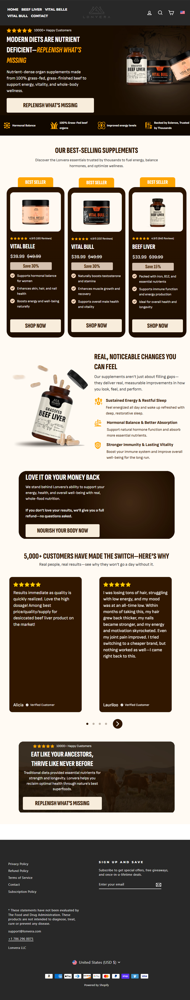

Lonvera
Website: https://lonvera.com
Tracking URL: Không có public tracking page
Category: Ancestral Beef Organ Supplements (Liver, Bull organs)
Nhóm phân loại: 3 (Không có tracking page public)

Giới thiệu brand
Lonvera là thương hiệu "ancestral organ supplement" tương tự Ancestral Supplements, chuyên về beef organ capsules: Beef Liver, Vital Bull (bull organs), Vital Belle (female-targeted blend). Brand định vị "Modern diets are nutrient deficient - replenish what's missing" và nhắm vào cộng đồng paleo/carnivore/ancestral nutrition. Sản phẩm từ grass-fed beef, freeze-dried. Có policy 100% money back guarantee.

Sản phẩm chủ lực
- Beef Liver (flagship grass-fed freeze-dried)
- Vital Bull (bull organs blend cho nam - testosterone support)
- Vital Belle (female blend)
- Bundle save 15-30% on 3 bestsellers
- Subscription policy

Tracking page - Mô tả UI
Không có public tracking page. Homepage layout long-form với hero, best-seller grid 3 product, testimonial 5-sao (5,000+ customers), 100% money back banner, email signup footer. Không có /apps/parcelpanel, /pages/track-order, /pages/tracking. Khách phải qua email Shopify hoặc login account.

Có upsell không? Nếu có, hình thức gì?
Không áp dụng trên tracking flow. Homepage có nhiều upsell: bundle 3 bestsellers với save 15-30%, subscription discount, testimonial social proof - nhưng toàn bộ là pre-purchase.

Vì sao họ chèn widget đó? (phân tích)
Lonvera theo mô hình ancestral single-page marketing:
1. SKU ít, cross-sell dễ handle qua email
2. Subscription auto-ship là KPI chính
3. Team nhỏ, chưa có resource cho tracking widget
4. Brand cộng đồng paleo thường trust email hơn widget commercial

Điểm mạnh của tracking page
- N/A

Điểm yếu / hạn chế
- Không self-service tracking
- Bỏ lỡ cross-sell Vital Bull ↔ Vital Belle ↔ Beef Liver (3 SKU rất natural)
- 5,000+ customers = lượng tracking query đáng kể bị lãng phí

Screenshot

