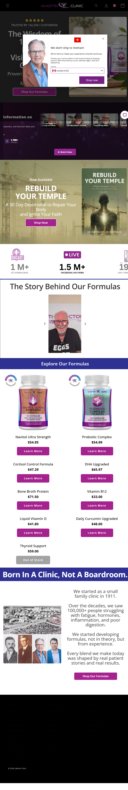

Martin Clinic
Website: https://martinclinic.com
Tracking URL: Không có public tracking page
Category: Natural Health / Doctor-Formulated Supplements (Canada)
Nhóm phân loại: 3 (Không có tracking page public)

Giới thiệu brand
Martin Clinic là thương hiệu natural health gốc Canada, "Born in a Clinic, Not a Boardroom" - bắt đầu từ một phòng khám gia đình nhỏ từ năm 1911 (Dr. Martin, 100,000+ bệnh nhân điều trị thực tế). Brand có Dr. Martin figurehead rõ ràng, chạy podcast và livestream (1M+ podcast downloads, 1.5M+ livestream views). Tập trung vào natural formulas từ thực nghiệm lâm sàng. Có book riêng "Rebuild Your Temple - A 30 Day Devotional to Repair Your Body and Ignite Your Faith" - tích hợp spirituality + health.

Sản phẩm chủ lực
- Navitol Ultra Strength ($54.95)
- Probiotic Complex ($14.99)
- Cortisol Control Formula ($47.29)
- DHA Upgraded ($65.97)
- Bone Broth Protein ($71.50)
- Vitamin B12 ($19.00)
- Liquid Vitamin D ($41.80)
- Daily Curcumin Upgraded ($48.00)
- Thyroid Support ($35.00 - out of stock)

Tracking page - Mô tả UI
Không có dedicated public tracking page. Homepage có popup opt-in mail list, hero "Wisdom of" Dr. Martin, podcast/livestream stats, Rebuild Your Temple book banner, "Story Behind Our Formulas" Dr. Martin video, product grid với 9 SKU và giá rõ ràng, "Born in a Clinic, Not a Boardroom" brand story section với ảnh các thế hệ bác sĩ Martin gia đình.

Có upsell không? Nếu có, hình thức gì?
Không áp dụng trên tracking flow. Homepage có:
- Product grid rõ ràng (9 SKU với giá)
- Book upsell (Rebuild Your Temple)
- Podcast/content lead gen
- Brand story emotional

Tất cả là pre-purchase, không có widget post-purchase.

Vì sao họ chèn widget đó? (phân tích)
Martin Clinic theo mô hình content-driven brand với figurehead doctor:
1. Retention dựa vào podcast, livestream, content (Dr. Martin fan base)
2. Khách thường là loyal follower → ít cần tracking UX
3. Book + faith-based angle tạo community hơn commercial
4. Team nhỏ (family clinic origin) → chưa đầu tư tech tracking
5. Tracking query có thể được handle qua email hoặc phone clinic

Điểm mạnh của tracking page
- N/A

Điểm yếu / hạn chế
- Không self-service
- 9 SKU + book = cross-sell potential lớn nhưng chưa khai thác
- 1M+ podcast listener = audience đáng kể không có touchpoint post-purchase
- Pitch phù hợp: widget tracking tích hợp với podcast/content promo (episode mới)

Screenshot

