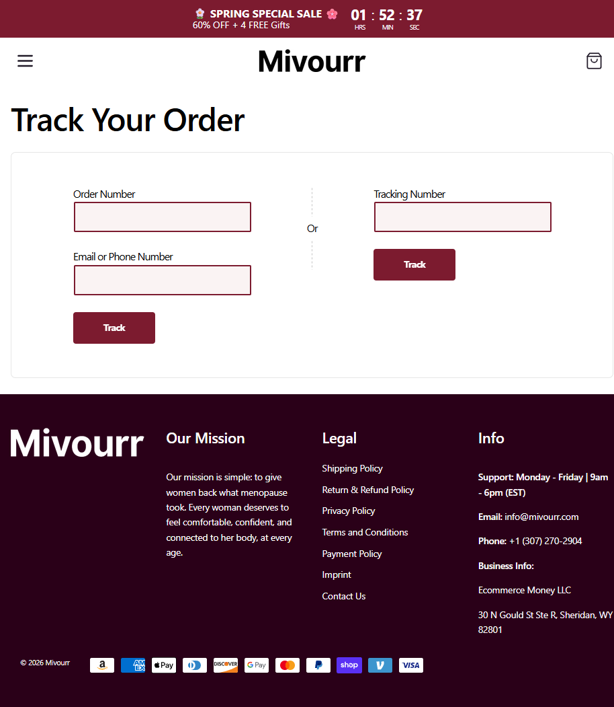

Mivourr
Website: https://mivourr.com
Tracking URL: https://mivourr.com/apps/track-your-order
Category: Women's Intimate Health / Menopause Support
Nhóm phân loại: 2 (Có tracking page nhưng không có upsell widget contextual)

Giới thiệu brand
Mivourr là thương hiệu women's intimate health DTC với mission "give women back what menopause took". Target rõ ràng vào phụ nữ menopause/perimenopause đối mặt với các vấn đề intimate health (vaginal dryness, discomfort, libido). Operator là Ecommerce Money LLC tại Sheridan Wyoming. Brand chạy aggressive promo "Spring Special Sale 60% OFF + 4 FREE Gifts" với countdown timer urgency. Shopify store.

Sản phẩm chủ lực
- Mivourr Intimate Wellness (flagship - menopause-focused intimate health)
- Bundle 2-3 với free gifts
- Subscription auto-ship
- (Không verify được portfolio rộng hơn do chưa click vào menu)

Tracking page - Mô tả UI
Trang /apps/track-your-order có layout sạch:
1. Announcement bar burgundy đậm "Spring Special Sale 60% OFF + 4 FREE Gifts" với countdown HH:MM:SS
2. Header logo Mivourr wordmark
3. Heading "Track Your Order"
4. Dual input form trong card: Order Number + Email/Phone OR Tracking Number (2 cột)
5. 2 button "Track" burgundy
6. Footer dark 4 cột: Logo + Our Mission (menopause story), Legal (shipping, return, privacy, terms, payment, imprint, contact), Info (support hours Mon-Fri 9am-6pm EST, email, phone, business info)

Có upsell không? Nếu có, hình thức gì?
Rất hạn chế:
- Announcement bar countdown timer 60% off + 4 FREE gifts - urgency marketing
- Mission statement tạo emotional connection
Không có product grid, không có bundle cross-sell contextual, không có quiz, không có testimonial.

Vì sao họ chèn widget đó? (phân tích)
Mivourr chọn minimal tracking UX:
1. Category sensitive (intimate health) → brand cẩn trọng không aggressive upsell
2. Countdown timer + free gift là hook đủ mạnh, họ tin không cần thêm
3. Target khách hàng 45+ thường prefer clean interface, không overwhelm
4. Business nhỏ (Ecommerce Money LLC) - có thể chỉ 1-2 SKU chủ đạo
5. Focus budget vào paid social cho women's health content

Điểm mạnh của tracking page
- Clean, professional
- Countdown timer tạo urgency ngay cả trên tracking page (smart!)
- Mission statement có emotional resonance
- Support hours rõ ràng, phone US
- Dual input thuận tiện

Điểm yếu / hạn chế
- Không có product recommendation (điều này QUAN TRỌNG với menopause brand vì có nhiều cross-sell tiềm năng: hormone support, sleep, mood, digestive)
- Không có social proof / testimonial
- Không có bundle visual
- Đây là use case pitch rõ ràng: brand đã có khách đúng segment, chỉ cần thêm widget upsell để tăng AOV

Screenshot

