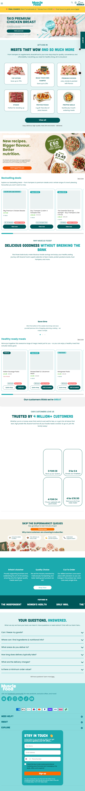

MuscleFood
Website: https://www.musclefood.com
Tracking URL: Không có public tracking page
Category: UK Meal Delivery / Healthy Food / Sports Nutrition
Nhóm phân loại: 3 (Không có tracking page public)

Giới thiệu brand
MuscleFood là thương hiệu food delivery DTC gốc UK, bán thực phẩm "healthy & high-protein" (thịt, gia cầm, hải sản, ready meal) phục vụ khách tập gym, healthy eating. Brand tuyên bố "trusted by 5 million+ customers" và có dòng signature như Chicken Breast 5KG, Tomahawk Steak, diet meal plan. Category của họ gần hơn với grocery/meal-kit thay vì supplement.

Sản phẩm chủ lực
- Premium Chicken Breast (5KG flagship)
- Steaks (Tomahawk, T-Bone, Ribeye)
- Ready-to-eat meal plans / bundles
- Protein powder, bars, snacks
- Healthy groceries (eggs, cheese, pasta)
- Goodness Bundle / subscription

Tracking page - Mô tả UI
Không tìm thấy public tracking page sau khi kiểm tra các pattern phổ biến: /track-order, /pages/tracking, /customer/orders/find, /help-centre, musclefood.aftership.com - tất cả đều 404 hoặc redirect. Brand dùng mô hình food delivery nên có thể tracking được xử lý qua email carrier-specific (DPD, Royal Mail) và qua tài khoản login tại account dashboard. Footer chỉ có link "Contact" và live chat Gorgias.

Có upsell không? Nếu có, hình thức gì?
Không áp dụng do không có tracking page. Brand chạy upsell mạnh ở homepage và giỏ hàng (bundle deals, £5 off teaser, announcement bar steak promo) nhưng chưa có ở post-purchase tracking flow.

Vì sao họ chèn widget đó? (phân tích)
MuscleFood thuộc food delivery category nên:
1. Tracking thường do carrier xử lý realtime (lạnh, tươi sống) - brand không kiểm soát trực tiếp
2. Order có frequency cao (weekly subscription) nên khách ít phụ thuộc vào tracking page
3. Ưu tiên Gorgias live chat để giải quyết shipping issues thay vì self-service
Tuy nhiên 5M+ khách = lượng "where is my order" ticket khổng lồ → cơ hội rõ ràng.

Điểm mạnh của tracking page
- N/A

Điểm yếu / hạn chế
- Không self-service cho khách guest
- Phụ thuộc carrier email
- Gây áp lực lên Gorgias live chat
- Cross-sell từ meat sang protein powder/snack chưa được khai thác
- Brand có volume lớn nhất trong list → pitch value cao nhất

Screenshot

