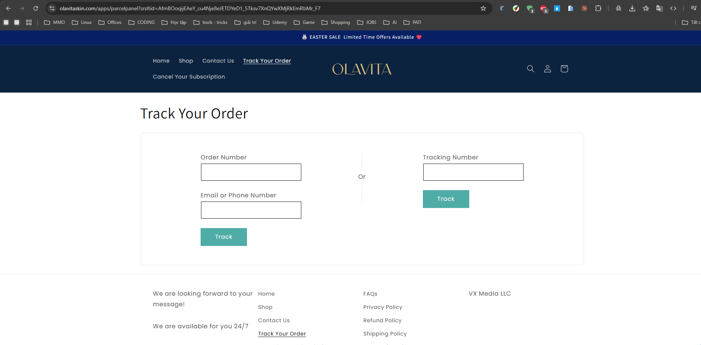

Olavita Skincare
Website: https://olavitaskin.com
Tracking URL: https://olavitaskin.com/apps/parcelpanel
Category: Skincare / Anti-aging
Nhóm phân loại: 2 (Có tracking page nhưng không có upsell widget tích hợp)

Giới thiệu brand
Olavita là thương hiệu skincare DTC, vận hành trên Shopify, tập trung vào các dòng anti-aging và brightening. Brand dùng app ParcelPanel (một trong những tracking app phổ biến trên Shopify App Store) để cung cấp order lookup cho khách.

Sản phẩm chủ lực
- Face serum (retinol, vitamin C, peptide)
- Moisturizer / cream
- Eye cream anti-aging
- Cleanser / toner
- Bundle "complete routine"

Tracking page - Mô tả UI
Trang /apps/parcelpanel là widget default của ParcelPanel: form nhập order number + email, sau submit hiển thị status progress bar có icon (Ordered → Packed → Shipped → Out for Delivery → Delivered), kèm map ship và shipment log event theo dòng thời gian. Header/footer brand vẫn hiện, nhưng nội dung giữa trang là của ParcelPanel.

Có upsell không? Nếu có, hình thức gì?
Không có upsell tích hợp. ParcelPanel free/basic tier không có module product recommendation tích hợp sâu. Chỉ có banner header và link shop. Khách xem tracking xong thoát luôn, brand không capture được value.

Vì sao họ chèn widget đó? (phân tích)
Olavita chọn ParcelPanel vì:
1. Dễ cài, miễn phí cho tier cơ bản
2. Thiết kế sẵn tốt hơn Shopify default
3. Branding team chưa có kinh nghiệm thiết kế tracking page custom
Đây là case điển hình: brand đã có nhận thức về tracking UX (cài app) nhưng chưa khai thác commercial → cơ hội pitch upgrade widget.

Điểm mạnh của tracking page
- UX ParcelPanel khá ổn (có map, có progress bar visual)
- Dễ maintain
- Self-service hoạt động tốt

Điểm yếu / hạn chế
- Không có product recommendation
- Không custom theo brand voice
- Bỏ lỡ cross-sell routine skincare
- Giới hạn bởi template của app third-party

Screenshot

