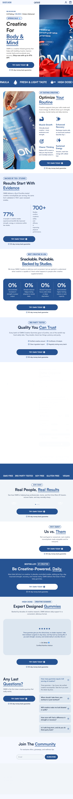

OMNI Creatine
Website: https://omnicreatine.com
Tracking URL: Không có public tracking page
Category: Sports Nutrition / Creatine Gummies / Strength & Cognitive
Nhóm phân loại: 3 (Không có tracking page public)

Giới thiệu brand
OMNI Creatine là thương hiệu creatine dạng gummy DTC, định vị "Creatine For Body & Mind" - phá bỏ hình ảnh creatine truyền thống (chỉ cho gym bro) bằng cách nhắm vào cả cognitive/mental performance. Sản phẩm là creatine gummy "snackable, packable, backed by studies". Có công thức "Expert Designed Gummies" với 77% effectiveness claim, 700+ reviews. Brand có community angle "Be Creatine-Powered. Daily".

Sản phẩm chủ lực
- OMNI Creatine Gummies (flagship - duy nhất)
- Bundle 2-3 bottles
- Subscription

Tracking page - Mô tả UI
Không có public tracking page. Homepage layout long-form single-product với: hero product, "Optimize Your Routine", "Results Start With Evidence" (77% efficacy, 700+ reviews), "Snackable, Packable, Backed by Studies", "Quality You Can Trust" (0% fillers, 0% artificial, 0% sugar, 0% gluten), "Us vs Them" comparison, "Be Creatine-Powered Daily" subscription CTA, FAQ, "Join The Community".

Có upsell không? Nếu có, hình thức gì?
Không áp dụng trên tracking flow. Homepage có nhiều upsell pre-purchase: subscription discount, bundle, FAQ, comparison table - nhưng post-purchase không có widget.

Vì sao họ chèn widget đó? (phân tích)
OMNI Creatine theo mô hình single-product VSL/longform:
1. Brand mới tập trung scale flagship gummy, chưa mở rộng SKU
2. Cross-sell bị giới hạn do chỉ có 1 sản phẩm
3. Retention dựa vào subscription lock-in
4. Community "Be Creatine-Powered Daily" là retention channel chính

Điểm mạnh của tracking page
- N/A

Điểm yếu / hạn chế
- Không self-service
- 700+ reviews = có base khách hàng, nhưng không có touchpoint post-purchase
- Bỏ lỡ cơ hội upgrade bundle khi khách chờ đơn
- Không có education content (rất cần cho creatine new-to-category khách)

Screenshot

