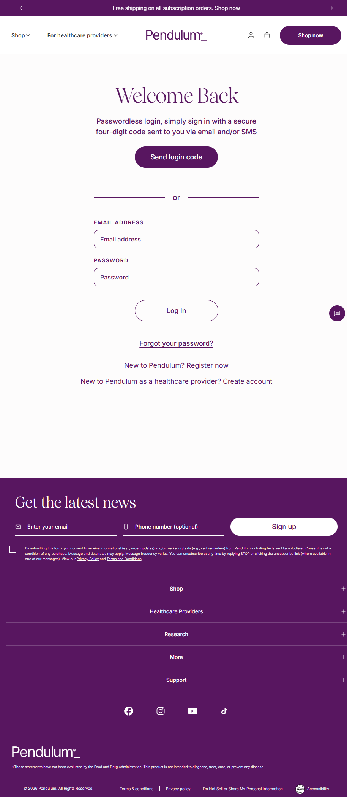

Pendulum
Website: https://pendulumlife.com
Tracking URL: Chỉ truy cập qua login account (https://pendulumlife.com/account/login) - không có public guest tracking
Category: Probiotics / Gut Health / Metabolic Health
Nhóm phân loại: 3 (Không có public tracking page - login gated)

Giới thiệu brand
Pendulum là thương hiệu probiotic thế hệ mới (next generation probiotics) gốc San Francisco, founded bởi khoa học gia từ Stanford/Berkeley. Nổi tiếng với flagship Akkermansia muciniphila probiotic - một strain được research mạnh về metabolic health và A1C control. Brand có endorsement của Halle Berry (co-owner và ambassador) và được bán qua DTC + bác sĩ. Target khách hàng cao cấp, có thu nhập cao, quan tâm sức khỏe chuyên sâu. Có dòng "For healthcare providers" riêng.

Sản phẩm chủ lực
- Pendulum Glucose Control (Akkermansia blend - flagship)
- Akkermansia (single strain)
- Metabolic Daily
- Butyricum (GI health)
- Polyphenol Booster
- Subscription auto-ship

Tracking page - Mô tả UI
Pendulum không có public tracking page. Khách phải đi qua /account/login với flow passwordless (4-digit code qua email/SMS) hoặc email+password truyền thống. Trang login có Welcome Back heading, form passwordless + traditional login, link Register, healthcare provider signup. Footer có newsletter capture, menu collapse (Shop, Healthcare Providers, Research, More, Support).

Có upsell không? Nếu có, hình thức gì?
Không áp dụng trên tracking flow vì đã gated. Footer có:
- Newsletter capture email + phone
- Announcement bar "Free shipping on all subscription orders" - push subscription
- Shop navigation

Vì sao họ chèn widget đó? (phân tích)
Pendulum chọn login-gated tracking vì:
1. Brand premium/medical-grade cần compliance và privacy cao
2. Khách hàng thuộc segment thu nhập cao, đã có account để quản lý subscription
3. Flow passwordless tương đối thuận tiện - không hẳn là barrier
4. Account dashboard cho phép hiển thị tracking + subscription + lab test info tích hợp
5. Không muốn mở public lookup vì data sensitive (health info)

Điểm mạnh của tracking page
- Compliance-friendly cho health data
- Passwordless login giảm friction
- Tích hợp với subscription portal và healthcare provider flow

Điểm yếu / hạn chế
- Guest khách không check đơn được nhanh
- Login barrier làm tăng support ticket ("I can't find my order")
- Không tận dụng post-purchase traffic cho cross-sell probiotic SKU
- Pitch khó hơn vì brand có rationale compliance rõ ràng

Screenshot

