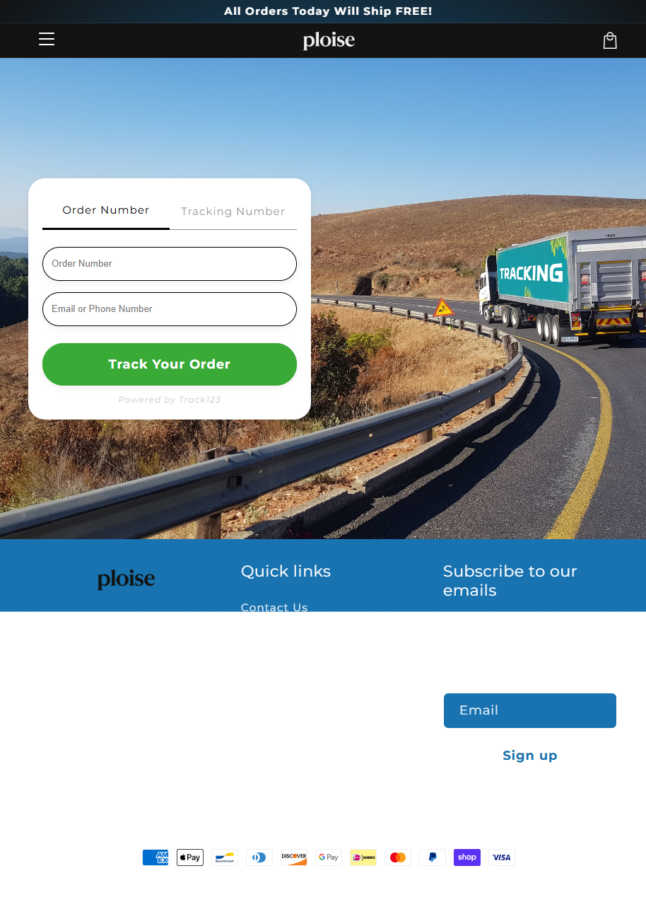

Ploise
Website: https://ploise.com
Tracking URL: https://ploise.com/apps/track123
Category: Shopify DTC / Lifestyle (có thể là wellness/beauty)
Nhóm phân loại: 2 (Có tracking page nhưng không có upsell widget)

Giới thiệu brand
Ploise là một brand DTC chạy trên Shopify với branding tối giản, logo wordmark clean. Brand scale nhỏ hơn các brand lớn trong list, signals cho thấy họ đang dùng app Track123 làm tracking backend (hiển thị "Powered by Track123" dưới form). Hiện chưa có nhiều public info về positioning/category cụ thể của brand.

Sản phẩm chủ lực
- Chưa thu thập được từ homepage (layout minimalist)
- Dự đoán: wellness/beauty DTC SKU nhỏ (<10 products)

Tracking page - Mô tả UI
Trang /apps/track123 có layout rất đẹp: hero image (đường cao tốc với xe tải "TRACKING") làm background, form tracking overlay với 2 tab (Order Number / Tracking Number), input Order Number + Email/Phone, CTA button xanh lá "Track Your Order". Dưới form là footer tối giản với logo, Quick links (Contact Us), email subscribe form, payment icons. Design clean, mobile-optimized.

Có upsell không? Nếu có, hình thức gì?
Không có upsell tích hợp. Trang chỉ làm tốt chức năng check đơn với branding đẹp, nhưng không có:
- Product recommendation
- Bundle cross-sell
- Content block
- Quiz / interactive element
- Social proof

Chỉ có "Subscribe to our emails" là một dạng capture, nhưng không phải upsell sản phẩm.

Vì sao họ chèn widget đó? (phân tích)
Ploise chọn Track123 - một app cùng tier với AfterShip/ParcelPanel - vì:
1. Dễ cài, có UI đẹp sẵn
2. Brand ưu tiên aesthetic hơn monetization
3. Scale nhỏ nên chưa cần optimize post-purchase
Tuy nhiên design đẹp nhưng không commercial = cơ hội nâng cấp rõ ràng.

Điểm mạnh của tracking page
- Design đẹp, nhất quán brand
- UX clean, không gây phiền
- Multi-input (Order hoặc Tracking number)
- Load nhanh

Điểm yếu / hạn chế
- Không có bất kỳ module upsell nào
- Email capture đơn giản, không có hook discount
- Bỏ lỡ toàn bộ cơ hội cross-sell

Screenshot

