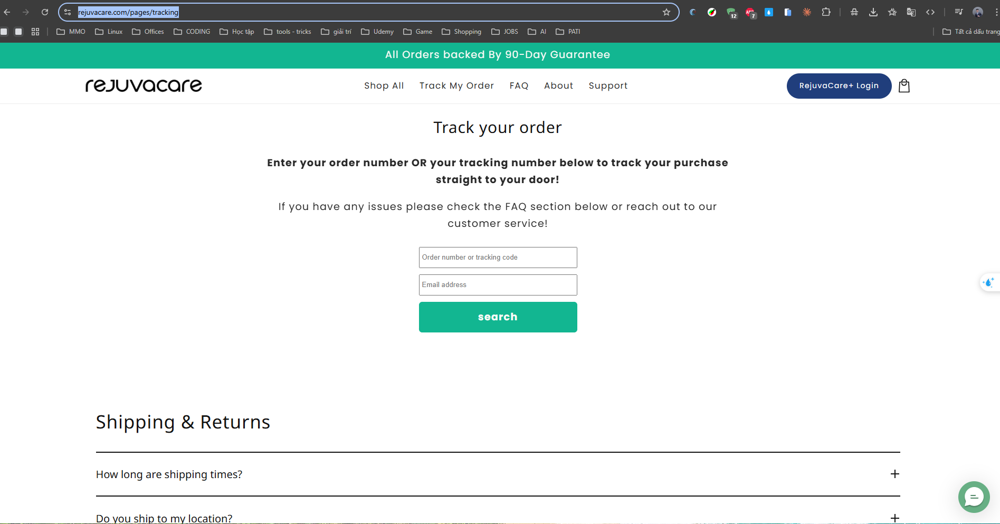

RejuvaCare
Website: https://www.rejuvacare.com
Tracking URL: https://www.rejuvacare.com/pages/tracking
Category: General Wellness / Weight Loss / Pain Relief
Nhóm phân loại: 2 (Có tracking page nhưng không upsell)

Giới thiệu brand
RejuvaCare là thương hiệu DTC wellness với slogan "All Natural Solutions", tuyên bố được phát triển bởi health professionals và có cộng đồng 400.000+ khách hàng. Họ định vị ở ba ngách chính: giảm cân, giảm đau, và tăng năng lượng/vitality hàng ngày. Chạy trên Shopify với dòng sản phẩm natural/herbal.

Sản phẩm chủ lực
- Các công thức natural weight loss
- Pain relief topicals / supplements
- Daily vitality stack (multivitamin, energy, immune)
- Herbal wellness formulas
- Combo / bundle theo "perfect solution" quiz

Tracking page - Mô tả UI
Trang /pages/tracking là layout Shopify standard: header brand, form nhập Order Number + email, sau submit hiển thị status timeline và thông tin carrier. Không có section upsell riêng, không có product recommendation. Trang gần như thuần chức năng.

Có upsell không? Nếu có, hình thức gì?
Không có upsell widget rõ rệt trên tracking page. Chỉ có header/footer navigation dẫn về shop, nhưng không có banner khuyến mãi, không có product grid, không có bundle recommendation, không có quiz.

Vì sao họ chèn widget đó? (phân tích)
RejuvaCare dường như chỉ coi tracking page là "tiện ích bắt buộc" chứ chưa xem là kênh marketing. Có thể do:
1. Marketing team tập trung ở paid acquisition + email flow, chưa để ý post-purchase UX
2. Sử dụng app tracking mặc định của Shopify không có slot upsell
3. Tâm lý "không muốn làm phiền khách khi họ đang lo đơn hàng"

Điểm mạnh của tracking page
- Đơn giản, load nhanh
- Không gây phiền nhiễu
- Tích hợp với Shopify order lookup

Điểm yếu / hạn chế
- Bỏ lỡ hoàn toàn cơ hội upsell từ traffic post-purchase
- Không có personalization
- 400K+ khách = lượng tracking page view rất lớn đang bị lãng phí
- Đây là brand tiềm năng để PATI pitch widget upsell

Screenshot

