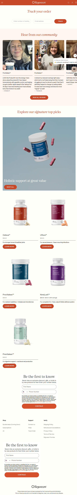

Rejuveen
Website: https://rejuveen.com
Tracking URL: https://rejuveen.com/pages/tracking
Category: Women's Wellness / Skincare / Anti-aging (từ UGC community)
Nhóm phân loại: 1 (Có tracking page + Có upsell tích hợp)

Giới thiệu brand
Rejuveen LLC là thương hiệu wellness/skincare DTC, định vị qua cộng đồng khách hàng (nhiều UGC video testimonial trên tracking page). Brand có voice ấm áp, nhắm vào phụ nữ trung niên quan tâm đến signature top picks - có thể là skincare/anti-aging/wellness cho da. Chạy trên Shopify với color palette warm/orange-red.

Sản phẩm chủ lực
- "Signature top picks" (hiển thị trên tracking page)
- Wellness/skincare routine SKU
- (Không đọc được chi tiết SKU từ screenshot loading)

Tracking page - Mô tả UI
Trang /pages/tracking có layout ĐẸP và giàu content:
1. Header "Track your order" với form 3 trường (Order number/tracking + Email, button Check màu đỏ cam)
2. Section "Hear from our community" với 3-card UGC video testimonial từ khách thật (mỗi card có ảnh + tên + testimonial text + CTA "Read all reviews")
3. Section "Explore our signature top picks" với product grid (loading chưa đầy đủ trong screenshot nhưng có slot)
4. Email/SMS capture "Be the first to know" ở footer với form Full Name + Phone Number
5. Footer navigation Shop/Support/Verify

Có upsell không? Nếu có, hình thức gì?
Có, đa dạng:
- UGC testimonial video carousel (social proof mạnh, build trust)
- "Signature top picks" product grid (direct cross-sell)
- Email/SMS capture với CTA "Be the first to know" về sales/discount
- "Read all reviews" CTA dẫn đến full review page

Vì sao họ chèn widget đó? (phân tích)
Rejuveen tận dụng community-driven marketing cực kỳ thông minh:
1. UGC video testimonial từ khách thật = social proof cao nhất có thể (gấp 10 lần review text)
2. Khách đang chờ đơn và xem testimonial = validation cho quyết định mua, giảm return rate
3. Top picks grid giúp cross-sell SKU phù hợp với signature routine
4. Email/SMS capture tại moment of high trust (sau khi đã mua) → list quality cao
5. Brand voice ấm, targeting phụ nữ 40+ thích "hear from community"

Điểm mạnh của tracking page
- UGC video testimonial - điểm khác biệt so với 30+ brand khác trong list
- Design warm, friendly, phù hợp demographic
- Email + SMS dual capture
- Cân bằng functional + commercial
- Social proof đặt đúng vị trí

Điểm yếu / hạn chế
- Product grid loading chậm có thể bị bỏ qua
- Hơi dài, có thể làm loãng mục đích chính
- Chưa có quiz personalization
- Không có bundle discount rõ rệt

Screenshot

