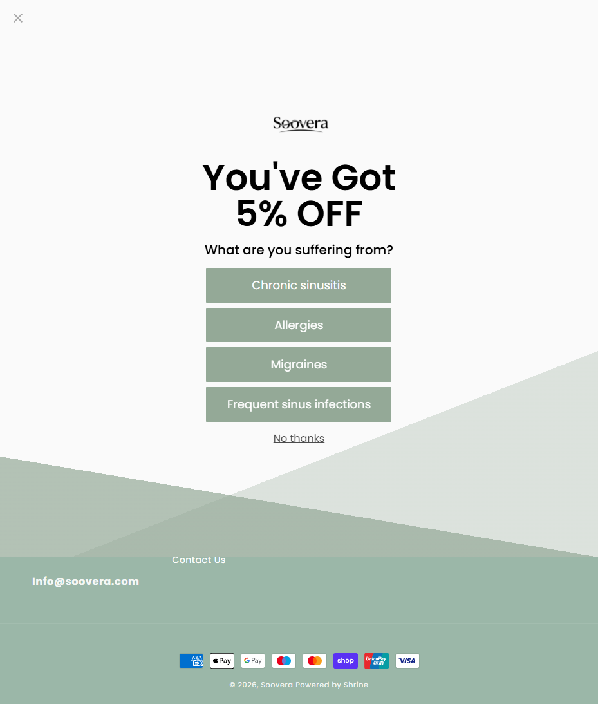

Soovera
Website: https://soovera.com
Tracking URL: https://soovera.com/apps/parcelpanel
Category: Sinus & Allergy Relief / Respiratory Wellness
Nhóm phân loại: 1 (Có tracking page + Có upsell quiz popup mạnh)

Giới thiệu brand
Soovera là thương hiệu DTC wellness chuyên về sinus & allergy relief, nhắm vào khách hàng đối mặt với chronic sinusitis, allergies, migraines, frequent sinus infections. Brand chạy Shopify (powered by Shrine theme), có setup tracking page với app ParcelPanel và rất thông minh trong việc sử dụng post-purchase traffic cho segmentation + discount capture.

Sản phẩm chủ lực
- Sản phẩm sinus relief (có thể là nasal spray, rinse kit, inhaler hoặc supplement)
- Sản phẩm allergy relief
- Migraine / headache formulas
- (Chưa verify chi tiết SKU do popup quiz chiếm toàn bộ màn hình)

Tracking page - Mô tả UI
Trang /apps/parcelpanel có một popup overlay FULL SCREEN ngay khi load:
1. Logo Soovera (wordmark đen minimalist)
2. Heading "You've Got 5% OFF" (bold, huge)
3. Sub-heading "What are you suffering from?"
4. 4 button lựa chọn green/sage color:
   - Chronic sinusitis
   - Allergies
   - Migraines
   - Frequent sinus infections
5. Link "No thanks" để skip
6. Background: sage green minimal
7. Footer: Info@soovera.com, Contact Us, Powered by Shrine

Tracking form bị che hoàn toàn bởi popup - phải click "No thanks" hoặc chọn 1 option mới thấy.

Có upsell không? Nếu có, hình thức gì?
Có, rất thông minh:
- **Quiz segmentation popup** ngay tại tracking page - đây là highlight lớn
- 5% discount hook để incentivize khách click
- 4 option cover toàn bộ pain point chính của brand → dữ liệu segmentation cho CRM
- Dẫn khách sang collection phù hợp với pain point họ chọn (inferred - chưa click verify)

Vì sao họ chèn widget đó? (phân tích)
Soovera là một trong 3 brand trong list hiểu post-purchase traffic tốt nhất (cùng Inno Supps và Rejuveen):
1. Tracking page = moment of anticipation + trust cao → perfect cho survey/quiz
2. 5% off nhỏ nhưng đủ để incentivize (không erode margin như 20%)
3. Segment theo pain point → personalize email + retargeting → cross-sell SKU phù hợp
4. Data quality từ quiz cao hơn nhiều so với discount-only capture
5. Category sinus/allergy thường có nhiều comorbidity (allergies + migraines cùng nhau) → bundle opportunity
6. Post-quiz có thể redirect sang landing page education + collection

Điểm mạnh của tracking page
- Quiz popup là BEST PRACTICE trong list
- Minimal green/sage UI thẩm mỹ cao
- Segmentation hữu ích cho CRM
- Discount vừa phải (5%) bảo vệ margin
- "No thanks" option tôn trọng khách (không dark pattern)

Điểm yếu / hạn chế
- Popup che hoàn toàn tracking form - có thể gây khó chịu với khách chỉ muốn check đơn
- Brand positioning chưa visible nếu khách chưa chọn option
- Không có social proof trên tracking UI
- Nên A/B test popup vs inline quiz

Screenshot

