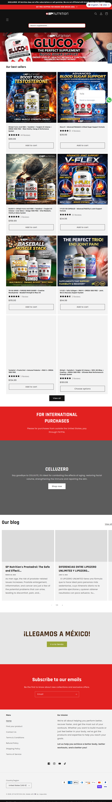

SP Nutrition (Snutrition USA)
Website: https://snutritionusa.com (domain spnutrition.com đã bị parked)
Tracking URL: Không tìm thấy public tracking page
Category: Sports Nutrition / Joint Health / Blood Sugar / Testosterone (Men's Health)
Nhóm phân loại: 3 (Không có tracking page public)

Giới thiệu brand
SP Nutrition USA là thương hiệu supplement đa ngách, SKU line rộng phủ từ sports nutrition (baseball muscle stack) đến joint health (V-Flex), blood sugar support (GLUCO-9), testosterone booster. Brand có dấu ấn Hispanic market rõ rệt - homepage có banner "¡Llegamos a México!" (We arrived in Mexico), blog bilingual, disclaimer nói rõ brand không liên quan đến các brand trùng tên. Design theo style sports nutrition cổ điển (comic art, flames, bold color).

Sản phẩm chủ lực
- GLUCO-9 (blood sugar "perfect supplement")
- Boost Your Testosterone 1000
- Advanced Blood Sugar Support
- V-Flex (Advanced Joint Support)
- Baseball Muscle Stack
- The Perfect Trio (end joint pain)
- Celluzero

Tracking page - Mô tả UI
Không tìm thấy public tracking page qua common URL patterns. Homepage là product-grid heavy với best sellers, blog, "For International Purchases" section (cho khách quốc tế). Không có footer link "Track Order". Khách có thể phải dùng email giao dịch.

Có upsell không? Nếu có, hình thức gì?
Không áp dụng trên tracking flow. Homepage có nhiều upsell pre-purchase: banner flash sale, best sellers grid, "Perfect Trio" bundle, international shipping promo - nhưng post-purchase không có widget.

Vì sao họ chèn widget đó? (phân tích)
SP Nutrition theo mô hình truyền thống:
1. Portfolio quá rộng (sports → joint → blood sugar → men's health) khiến cross-sell khó personalized
2. Target Hispanic/Mexico market có phương thức thanh toán và hành vi khác (có thể bulk order qua account manager)
3. Marketing tập trung vào paid + TikTok/Facebook
4. Team có thể chưa có resource cho tracking UX

Điểm mạnh của tracking page
- N/A

Điểm yếu / hạn chế
- Không self-service
- SKU rộng không được cross-sell contextual
- Mất cơ hội giáo dục khách về Hispanic market hóa (tiếng Tây Ban Nha)
- Pitch phù hợp: widget tracking bilingual + product recommendation theo segment

Screenshot

