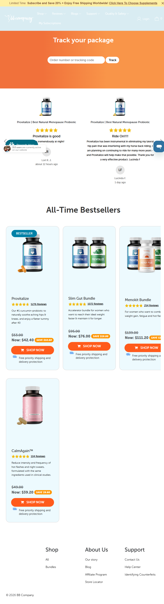

The BB Co (BB Company / Better Body Co.)
Website: https://thebbco.com
Tracking URL: https://thebbco.com/pages/track-your-order
Category: Women's Wellness / Menopause / Natural Probiotic
Nhóm phân loại: 1 (Có tracking page + Có upsell rất mạnh)

Giới thiệu brand
Better Body Co. (BB Company) là thương hiệu wellness DTC chuyên về sản phẩm tự nhiên cho phụ nữ từ 40+ đối mặt với hormonal change, menopause, weight management. Flagship product Provitalize là một trong những probiotic menopause bán chạy nhất thế giới, với hàng ngàn review 5 sao. Brand vận hành Shopify, chạy subscription mạnh với 20% off + free shipping global. Target khách hàng: phụ nữ 45-65.

Sản phẩm chủ lực
- Provitalize (flagship - Natural Menopause Probiotic, 5,376+ reviews)
- Slim Gut Bundle (Provitalize + companion product)
- Menokit Bundle (menopause comprehensive kit)
- CalmAgain™ (hot flashes & night sweats formula)
- Previtalize (prebiotic)
- Inergy+ (energy/metabolism)

Tracking page - Mô tả UI
Trang /pages/track-your-order thiết kế CỰC KỲ TỐI ƯU:
1. Header brand với navigation + announcement bar 20% off subscription
2. Hero cam "Track your package" với form đơn giản (Order number/tracking code + Track button)
3. Ngay dưới là 2 review khách hàng 5 sao (social proof với avatar + time stamp)
4. "All-Time Bestsellers" section: product grid 4 SKU với giá gốc gạch ngang, giá sale, save badge, Shop Now CTA cam
5. Mỗi product card có "Free priority shipping and delivery protection"
6. Footer đầy đủ (Shop, About Us, Support)

Có upsell không? Nếu có, hình thức gì?
Có, rất đa dạng và tinh vi:
- Social proof reviews ngay sau tracking form (build trust)
- All-Time Bestsellers grid với discount pricing rõ ràng
- Bundle cross-sell (Slim Gut Bundle, Menokit Bundle)
- Announcement bar subscription discount 20% off
- Free shipping + delivery protection USP nhắc lại nhiều lần
- Shop Now CTA cam (brand color) trên mỗi product

Vì sao họ chèn widget đó? (phân tích)
Better Body Co. là case study mẫu mực:
1. Category menopause có cross-sell rất tự nhiên (Provitalize → Slim Gut Bundle → Menokit → CalmAgain)
2. Khách mua Provitalize thường bị "stuck" ở single SKU → tracking page là cơ hội để giới thiệu ecosystem
3. Social proof là weapon chính của brand (hàng ngàn review) - dùng lại để chốt khách đang lưỡng lự
4. Subscription auto-ship là KPI chính - announcement bar 20% off đẩy conversion
5. Khách hàng 45+ thường trust brand hơn → social proof + bestseller grid cực hiệu quả

Điểm mạnh của tracking page
- Thiết kế phải nói là top tier trong list
- Cân bằng hoàn hảo: tracking chức năng + upsell không quá aggressive
- Brand voice nhất quán
- Social proof đặt đúng vị trí (ngay sau form)
- Product card có đầy đủ thông tin (giá, save, review, USP)
- Mobile-optimized

Điểm yếu / hạn chế
- Chỉ có 1 số SKU hiển thị, có thể rotate theo behavior
- Chưa có quiz hoặc personalization sâu
- Delivery protection USP có thể gây hoài nghi với khách mới

Screenshot

