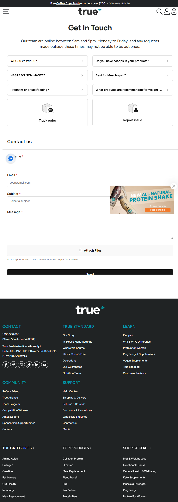

True Protein
Website: https://www.trueprotein.com.au
Tracking URL: https://www.trueprotein.com.au/pages/contact-us (có tile "Track order" trên trang contact)
Category: Sports Nutrition / Protein Powder (Australia)
Nhóm phân loại: 2 (Có entry point tracking nhưng không có dedicated page/upsell widget)

Giới thiệu brand
True Protein là thương hiệu sports nutrition Australia, headquarters tại Brookvale NSW, chuyên về clean protein powder và supplement cho thể thao. Định vị "in-house manufacturing", "plastic scoop-free", "where we source" transparency. Bán online-only tại Úc với hotline và hours 9am-5pm Mon-Fri AEDT. Portfolio rộng: Collagen, Creatine, Meal Replacement, Plant Protein, Pre-workout, Protein Bars.

Sản phẩm chủ lực
- Collagen Protein
- Creatine
- Meal Replacement
- Plant Protein
- PRE (pre-workout)
- Pro Define (premium whey)
- Protein Bars
- New All Natural Protein Shake (promo)

Tracking page - Mô tả UI
Brand không có /pages/tracking riêng. Thay vào đó trang /pages/contact-us là support hub với heading "Get In Touch", FAQ accordion (WPC80 vs WPI90, Scoops in products, HASTA, Muscle gain, Pregnant/breastfeeding, Weight loss), và 2 tile lớn: "Track order" + "Report issue" - đây là entry point tracking nhưng bản thân là link dẫn sang flow khác (có thể là account login hoặc external carrier). Có contact form Name/Email/Subject/Message. Footer rất chi tiết với 6 cột (Contact, True Standard, Learn, Community, Support, Top Categories, Top Products, Shop By Goal).

Có upsell không? Nếu có, hình thức gì?
Có một vài yếu tố nhẹ nhưng không phải widget contextual:
- Popup promo "New All Natural Protein Shake - Free Shipping" ở góc phải
- Announcement bar "Free Coffee Cup on orders over $200"
- Footer Shop By Goal (diet, functional fitness, muscle & strength, keto) - có thể coi là cross-sell navigation
- Refer a Friend link

Không có product recommendation grid, không có quiz, không có bundle cross-sell trên chính tracking flow.

Vì sao họ chèn widget đó? (phân tích)
True Protein chọn mô hình support-centric:
1. Brand Australia với scale vừa phải - ưu tiên customer service quality
2. Contact hub tích hợp FAQ + tracking + report issue - giảm support ticket
3. Footer rộng giúp cross-sell navigation nhưng không aggressive
4. Target khách hàng loyal (athlete, gym regular) - retention qua quality thay vì widget
5. Có thể họ dựa vào email notification của carrier + login account

Điểm mạnh của tracking page
- Contact hub integrated tốt (FAQ + tracking + report issue cùng một nơi)
- Footer category rộng, tạo discovery tốt
- Brand voice chuyên nghiệp
- Promo popup timing tốt

Điểm yếu / hạn chế
- Không có dedicated tracking page với form lookup
- Phụ thuộc vào account login hoặc carrier email
- Bỏ lỡ cơ hội upsell contextual
- Category sports nutrition có cross-sell tự nhiên rất lớn (pre → whey → recovery → collagen)

Screenshot

