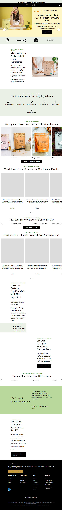

Truvani
Website: https://www.truvani.com (redirect → shop.truvani.com)
Tracking URL: Không có public tracking page
Category: Plant-Based Protein / Clean Label Supplements
Nhóm phân loại: 3 (Không có public tracking page)

Giới thiệu brand
Truvani là thương hiệu plant-based supplement gốc Mỹ co-founded bởi Vani Hari (the Food Babe). Định vị "clean label, no nasty ingredients", tập trung vào organic, non-GMO, plant-based. Brand có retail presence lớn (Walmart, Whole Foods), với cộng đồng follow từ Food Babe movement. Target khách hàng: phụ nữ quan tâm clean eating, plant-based lifestyle.

Sản phẩm chủ lực
- Plant Based Protein Powder (flagship - multiple flavors: Chocolate, Vanilla, Peanut Butter, Banana Cinnamon)
- The Only Bar (clean protein bar)
- Grass-Fed Collagen Peptides
- Turmeric, Apple Cider Vinegar, Greens
- Lemon Cookie Plant Based Protein (seasonal)

Tracking page - Mô tả UI
Không có public tracking page. Site redirect từ truvani.com → shop.truvani.com (Shopify shop subdomain). Các URL /pages/track-your-order, /apps/parcelpanel đều 404. Không có link "Track Order" trong header/footer. Khách phải dựa vào email giao dịch Shopify hoặc login account (không tìm thấy guest lookup).

Có upsell không? Nếu có, hình thức gì?
Không áp dụng do không có tracking page. Homepage có flavor carousel, bundle/subscription options, UGC testimonial creators - nhưng toàn bộ là sales page, không phải post-purchase flow.

Vì sao họ chèn widget đó? (phân tích)
Truvani phụ thuộc vào content marketing và influencer (Food Babe):
1. Retention chủ yếu qua email newsletter và Vani Hari's community
2. Retail presence (Walmart, Whole Foods) giảm nhu cầu DTC tracking UX
3. Brand ưu tiên trust/authority hơn commercial widget
4. Có thể họ dùng Shopify default order status link qua email

Điểm mạnh của tracking page
- N/A

Điểm yếu / hạn chế
- Không self-service tracking cho khách DTC
- Bỏ lỡ cross-sell giữa protein flavor và bar/collagen
- Subscription push cũng bị miss
- Support ticket tăng cho "where is my order"

Screenshot

