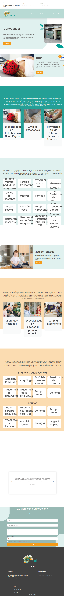

Zenther
Website: https://www.zenther.com
Tracking URL: Không áp dụng
Category: KHÔNG PHẢI WELLNESS SUPPLEMENT - là phòng khám phục hồi chức năng nhi khoa (Spain/Mexico)
Nhóm phân loại: 3 (Không có tracking page public + brand mismatch)

Giới thiệu brand
Domain zenther.com dẫn đến một phòng khám phục hồi chức năng thần kinh và trị liệu nhi khoa bằng tiếng Tây Ban Nha, CHUYÊN về:
- Terapia manual pediatric
- Neurología / Neurological rehab
- TDCS (transcranial direct current stimulation)
- Phục hồi chức năng trẻ em (atención temprana, anquilosis, parálisis cerebral, trastornos del aprendizaje)

Đây KHÔNG phải thương hiệu wellness/supplement như list brand yêu cầu. Có thể tên brand trong list là nhầm lẫn hoặc brand DTC supplement tên Zenther sử dụng domain khác (zenther.co, tryzenther.com, zentherwellness.com...). Cần sales team confirm lại tên chính xác.

Sản phẩm chủ lực
- N/A (clinic service không phải supplement)

Tracking page - Mô tả UI
Không áp dụng - đây là clinic website, không phải ecommerce.

Có upsell không? Nếu có, hình thức gì?
N/A

Vì sao họ chèn widget đó? (phân tích)
N/A

Điểm mạnh của tracking page
N/A

Điểm yếu / hạn chế
- Brand mismatch: list PATI có tên "Zenther" nhưng domain search ra clinic nhi khoa
- Cần sales team verify lại brand chính xác trước khi pitch

Ghi chú
RECOMMEND: Sales team check lại tên brand - có thể là "Zenther Wellness", "Zen Ther", "Zenithr" hoặc một variant khác. Loại brand hiện tại không phù hợp với use case PATI tracking widget.

Screenshot

